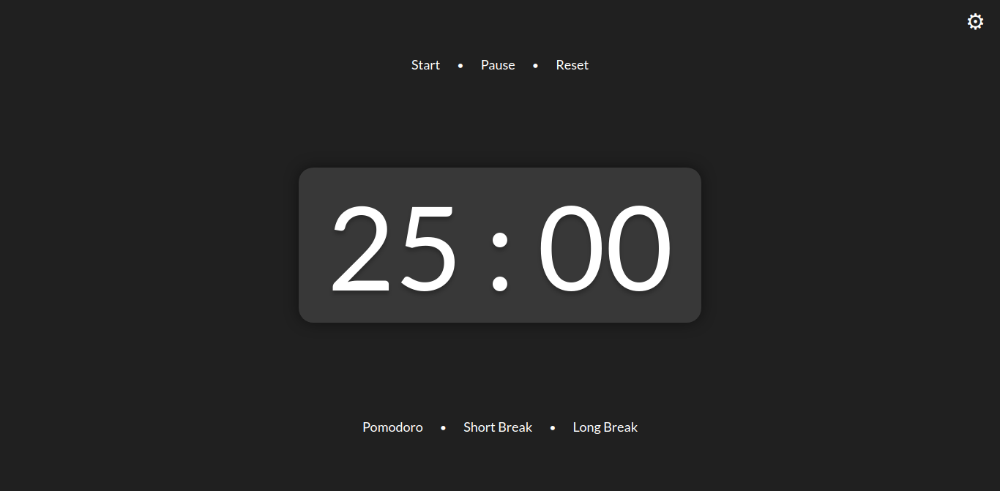
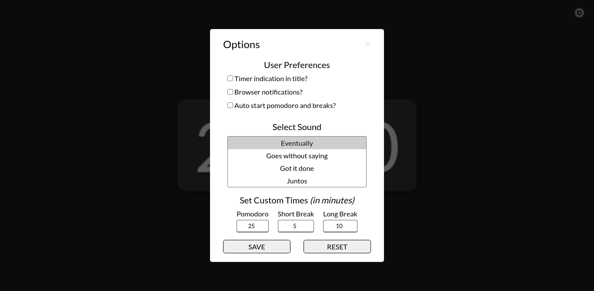

<h1>Pomodoro Timer</h1>
<h2>First Personal Project</h2>

  This project is inspired in the
  <a href="https://tomato-timer.com/" target="blank">Tomato Timer</a>, it is
  basically a timer that automatically reproduces the pomodoro technique, which
  is a way of being productive and don't loosing focus so fast, more about this
  on the following link:
  <a
    href="https://todoist.com/productivity-methods/pomodoro-technique"
    targer="blank"
    >Pomodoro Technique -- Why it Works and How to Do It?</a
  >. This projects is supposed to teach me how to deal with Time Data using
  JavaScript, dealing with layout designs using HTML and CSS, and also to help
  me practice my research skills when dealing with problems. I think is going to
  be fun doing it. 😁😁

<h3>2021-08-17 [UPDATE]:</h3>

This project took me way longer to acomplish than all the projects I ever did, it was really hard to get to work, but after some (actually many) bugs I finally got it to work properly. I probably need to refactor the code, but I am really scared of messing with it and it stop working. I think for now it is fine because I am getting started but later on I will definitely try to improve my coding skills by organizing my projects a bit more, I studied some good practices but is really hard to keep track of those and still get your project to work when you're just getting start at this coding world. So yes it was hard but the whole thing was amazing, specially when something worked out of blue. These are the skills that I applied when building this project:

<ul>
  <li>Dom Manipulation</li>
  <li>Event Listeners</li>
  <li>Logic and Data Flow</li>
  <li>JavaScript Stack</li>
  <li>Array Methods</li>
  <li>Functions</li>
  <li>Loops</li>
</ul>

For now this is the project and you can either access it by this link <a href="https://trusting-northcutt-833ed2.netlify.app/">Pomodoro Timer</a> or check the screenshots bellow.

<i>This is the main screen and where it all happens. You can start, pause and reset the timer at any moment, also it comes with these pre defined time sets.</i>

<i>This is the settings' modal window, where you can set your personal preferences.</i>

I am really proud of myself to keep coding even when things got harder, because now I see it was so worthyy. Thank you for your attention. 😁

